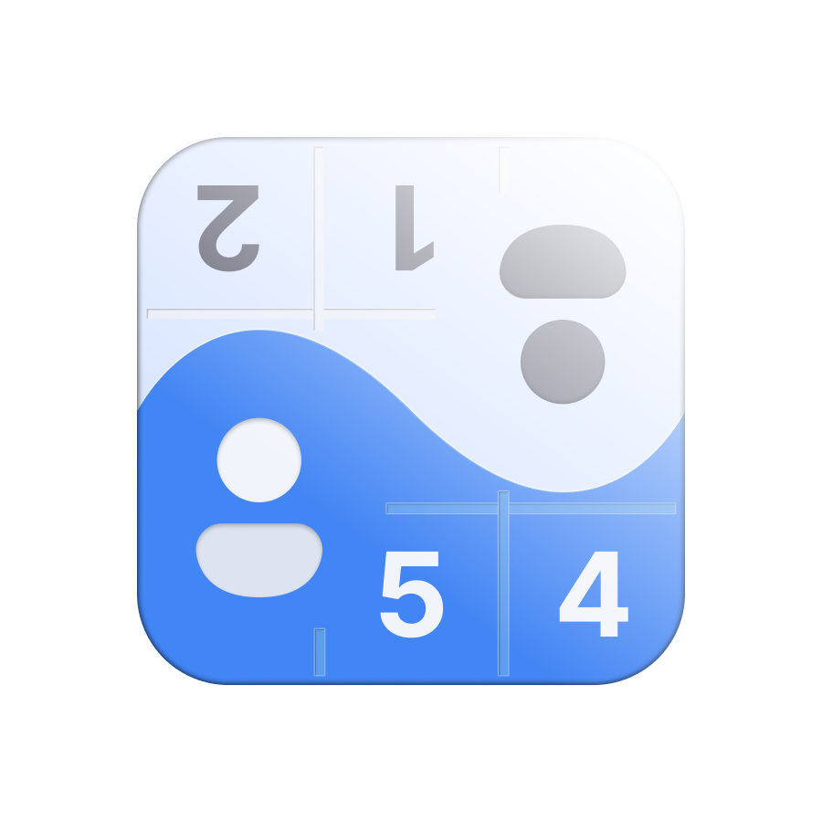

# 🎯 Sudoku Duo

<div align="center">
  
  
  **A revolutionary Sudoku experience combining classic gameplay with innovative two-player mode**
  
  [](https://github.com/yourusername/sudoku-duo)
  [](https://reactnative.dev/)
  [](https://expo.dev/)
  [](https://www.typescriptlang.org/)
  [](LICENSE)
</div>

<br>

## 📋 Table of Contents

- [Overview](#overview)
- [Google Play Store Description](#google-play-store-description)
- [Features](#features)
- [Tech Stack](#tech-stack)
- [Getting Started](#getting-started)
- [Development](#development)
- [Building](#building)
- [Architecture](#architecture)
- [License](#license)
- [Project Structure](#project-structure)

<br>

## 🎮 Overview

Sudoku Duo is a lovingly crafted, completely free Sudoku game without ads that reinvents the classic puzzle experience. It combines traditional single-player Sudoku with an innovative two-player mode unique to the mobile gaming landscape.

### What makes Sudoku Duo special?

- **100% Free, 0% Ads**: A hobby project built with passion and attention to detail
- **Innovative Duo Mode**: Two players, one board – compete or cooperate on the same device
- **Zen Progression System**: Level up through mindful gameplay with motivational messages
- **Personalization**: Unlock stunning backgrounds and customize your avatar
- **Professional Polish**: Smooth animations, haptic feedback, and intuitive UI

<br>

## 📱 Google Play Store Description

Sudoku Duo is a lovingly crafted, completely free Sudoku game without ads. It combines the classic puzzle game with an innovative two-player mode – unique on Google Play.

🧠 **Single Player Mode**
Solve classic Sudokus in four difficulty levels (Easy, Medium, Hard, Expert) – with intelligent helpers like notes, error display, hints and customizable game settings. All Sudokus are automatically generated and guaranteed solvable.

🧑‍🤝‍🧑 **Duo Mode – The Sudoku Experience for Two**
Discover Sudoku in a whole new way: Two players, one board – who solves their area first?
Numbers rotate, perspectives change – and suddenly the classic logic game becomes an exciting duel or cooperative adventure.
Quick thinking, logic and strategy are required – but also teamwork and intuition.
⚡ Experience a Sudoku dynamic like no other Sudoku app.

🏆 **Title System & Motivation**
Collect 25 unique titles on your Sudoku journey – from "Curious Mind" to "Enlightened Master". Choose your favorite title and show your Sudoku personality.

🧘 **Zen Level System**
Level up! Win games, rise in the Zen-inspired level system and experience real progress – inspiring at your pace.

🖼️ **Rewards & Personalization**
Unlock stunning images by winning games and personalize your background. Use filters and favorites to organize your collection. Choose from a collection of avatars or use your own image. Your Sudoku – your style.

🌍 **Multilingual**
Play in Deutsch, English or हिन्दी (Hindi) – the app automatically adapts to your language.

📊 **Track Your Performance**
Keep track of your winning streak, best times and game strength as a percentage. Develop yourself playfully – without pressure.

☁️ **Cloud-Sync & Account**
Create a free account (Google, Apple or E-Mail) and sync your progress across all devices. Your statistics, settings and streak are always backed up.

🔥 **Daily Streak**
Play every day and build your streak! Shield protection keeps you from losing progress – motivating and stress-free.

⚙️ **Smart Settings & Features**
- Pause function – resume anytime
- Automatic notes
- Light & Dark Mode
- Adjustable font size
- Background music
- Highlight cells and numbers
- Error display & vibration
- Undo / End game
- Clear tutorial with animation
- Share with friends & send feedback

💚 **100% free. 0% ads.**
Sudoku Duo is a hobby project with heart and attention to detail – developed to rethink Sudoku – playful, motivating and unique.

<br>

## ✨ Features

### 🧠 Single Player Mode
- Four difficulty levels (Easy, Medium, Hard, Expert)
- Intelligent hints and auto-notes system
- Error highlighting and validation
- Undo/redo functionality
- Progress tracking and statistics

### 👥 Duo Mode (Unique Feature)
- Split-screen competitive gameplay
- Rotating perspectives for fair play
- Real-time score tracking
- Cooperative and competitive variants

### 🎨 Customization & Rewards
- Zen-inspired level system with XP progression
- 25 unique titles to collect and display
- Unlockable landscape backgrounds with filters & favorites
- Custom avatar support (gallery or camera)
- Multiple theme options (Light/Dark mode)

### 📊 Statistics & Progress
- Win streaks and best times
- Difficulty-based progression unlocking
- Detailed performance metrics
- Achievement milestones

### ⚙️ Smart Features
- Cloud sync with account (Google/Apple/Email)
- Daily streak with shield protection
- Background music
- Adjustable font size (accessibility)
- Pause & resume functionality
- Automatic game state saving
- Configurable haptic feedback
- Multiple highlighting options
- Multilingual support (German, English, Hindi)
- Accessibility-focused design

<br>

## 🛠️ Tech Stack

### Core Technologies
- **Framework**: React Native 0.79.2 with Expo 53.0.7
- **Language**: TypeScript 5.8.3
- **Navigation**: Expo Router (File-based routing)
- **State Management**: React Context API
- **Storage**: AsyncStorage

### Key Libraries
- **Animations**: React Native Reanimated 3.17.4, Lottie React Native
- **UI Components**:
  - React Native Gesture Handler
  - React Native Safe Area Context
  - React Native SVG (with SVG Transformer)
  - Expo Vector Icons
- **Internationalization**: react-i18next, expo-localization
- **Monetization**: React Native Purchases (RevenueCat) for optional support
- **Visual Effects**:
  - Expo Blur
  - Expo Linear Gradient
  - Lottie Animations
- **Utilities**:
  - Expo Haptics
  - Expo Image Picker
  - Expo File System

<br>

## 🚀 Getting Started

### Prerequisites
- Node.js (v18 or higher)
- npm or yarn
- EAS CLI (`npm install -g eas-cli`)
- Android Studio (for Android development)
- Xcode (for iOS development, macOS only)

### Installation

1. **Clone the repository**
   ```bash
   git clone https://github.com/clemenssw/sudoku-duo.git
   cd sudoku-duo
   ```

2. **Install dependencies**
   ```bash
   npm install
   ```

3. **Create a development build** (required - Expo Go does NOT work!)
   ```bash
   eas build --profile development --platform android
   ```

4. **Install the development build on your device/emulator**

5. **Start the development server**
   ```bash
   npx expo start --dev-client
   ```

> **Note:** This app uses native modules (Firebase, RevenueCat) that are not compatible with Expo Go. You must use a development build.

<br>

## 💻 Development

### Development Workflow

1. **Theme System**
   The app uses a custom theme provider with automatic dark mode support:
   ```typescript
   import { useTheme } from '@/utils/theme/ThemeProvider';
   const theme = useTheme();
   ```

2. **Sudoku Engine**
   Core game logic is in `utils/sudoku/`:
   - `generator.ts` - Puzzle generation
   - `solver.ts` - Solution validation
   - `types.ts` - TypeScript interfaces

3. **State Management**
   - Game state: React Context (`GameContext`)
   - Settings: AsyncStorage with hooks
   - Navigation: Expo Router with file-based routing

### Code Style
- TypeScript strict mode enabled
- ESLint configuration included
- Prettier for code formatting

### Testing
```bash
npm test                 # Run all tests
npm test -- --watch     # Watch mode
```

<br>

## 🏗️ Building

This project uses [EAS Build](https://docs.expo.dev/build/introduction/) for creating app builds.

### Build Profiles Overview

| Profile | Command | Output | Use Case |
|---------|---------|--------|----------|
| `development` | `eas build --profile development --platform android` | APK | Development with hot reload |
| `preview` | `eas build --profile preview --platform android` | APK | Testing, share with friends |
| `production` | `eas build --platform android` | AAB | Google Play Store upload |

### Detailed Build Commands

#### Development Build
Creates a development client with debugging tools, hot reload, and dev menu.

```bash
# Android
eas build --profile development --platform android

# iOS
eas build --profile development --platform ios
```

After building, install the APK on your device and run:
```bash
npx expo start --dev-client
```

#### Preview Build (APK for Testing)
Creates a standalone APK that you can install directly on any Android device. Perfect for:
- Testing before release
- Sharing with beta testers
- Installing on devices without Play Store access

```bash
eas build --profile preview --platform android
```

The resulting APK can be downloaded from the EAS dashboard and installed via:
- Direct download link
- ADB: `adb install sudoku-duo.apk`
- File transfer to device

#### Production Build (Store Release)
Creates an optimized AAB (Android App Bundle) for Google Play Store submission.

```bash
# Android (AAB for Play Store)
eas build --platform android

# iOS (for App Store)
eas build --platform ios

# Both platforms
eas build --platform all
```

### APK vs AAB - What's the Difference?

| Format | Description |
|--------|-------------|
| **APK** | Single installable file. Can be shared and installed directly on any Android device. |
| **AAB** | App Bundle for Play Store. Google creates optimized APKs for each device type. Cannot be installed directly. |

### Local Development Build
For faster iteration during development (requires local toolchain):

```bash
# Android (requires Android Studio)
npx expo run:android

# iOS (requires Xcode, macOS only)
npx expo run:ios
```

### Configuration Files
- `eas.json` - EAS Build configuration (build profiles)
- `app.config.js` - Expo app configuration

### Firebase Configuration (google-services.json)

Die App nutzt Firebase für Authentication und Cloud Sync. Die Konfigurationsdatei `google-services.json` verbindet die App mit dem Firebase-Projekt.

#### Was ist das?
- Enthält Firebase Project ID, API Keys und OAuth Client IDs
- Enthält den **SHA-1 Fingerprint** des Keystores (wichtig für Google Sign-In!)
- Wird beim EAS Build automatisch von `./google-services.json` (Root) nach `android/app/` kopiert

#### Wann muss ich es aktualisieren?

| Situation | Aktion erforderlich |
|-----------|---------------------|
| Neuer EAS Keystore | SHA-1 in Firebase Console hinzufügen, neue `google-services.json` downloaden |
| Anderer Rechner/CI | SHA-1 prüfen und ggf. hinzufügen |
| `DEVELOPER_ERROR` bei Google Sign-In | SHA-1 Mismatch → siehe unten |
| Firebase-Projekt geändert | Neue `google-services.json` downloaden |

#### Wie aktualisiere ich es?

1. **SHA-1 des EAS Keystores finden:**
   - Gehe zu [expo.dev](https://expo.dev) → Dein Projekt → **Credentials** → Android → Keystore
   - Kopiere den **SHA-1 Fingerprint**

2. **SHA-1 zu Firebase hinzufügen:**
   - [Firebase Console](https://console.firebase.google.com/) öffnen
   - Project Settings → Deine Android App
   - "Add fingerprint" → SHA-1 einfügen → Speichern

3. **Neue google-services.json downloaden:**
   - In Firebase Console: Download `google-services.json`
   - Datei ins **Root-Verzeichnis** des Projekts legen (nicht in `android/app/`!)

4. **Neuen Build erstellen:**
   ```bash
   eas build --profile development --platform android
   ```

> **Tipp:** Die Datei im Root wird beim Build automatisch nach `android/app/` kopiert (siehe `app.config.js` Zeile 78).

<br>

## 🏛️ Architecture

### Component Architecture
- **Atomic Design**: Small, reusable components
- **Composition**: Complex features built from simple parts
- **Separation of Concerns**: Logic separated from presentation

### Data Flow
1. **Game State**: Centralized in GameContext
2. **User Settings**: Persisted in AsyncStorage
3. **Statistics**: Updated after each game
4. **Achievements**: Calculated based on statistics

### Performance Optimizations
- Memoized components with React.memo
- Optimized re-renders with useCallback/useMemo
- Lazy loading for heavy components
- Efficient animation with Reanimated

<br>

## 📝 License

This project is licensed under the MIT License - see the [LICENSE](LICENSE) file for details.

<br>

## 🙏 Acknowledgments

- Built with ❤️ as a hobby project
- Special thanks for all tester to the React Native and Expo communities

<br>

## 📞 Contact

- **Developer**: [Clemens Walther]
- **Email**: [info@playfusion-gate.de]
- **Project Link**: [https://github.com/clemenssw/sudoku-duo](https://github.com/clemenssw/sudoku-duo)

---


<br>

## 📁 Project Structure

```
sudoku
├─ android.view.Choreographer$FrameDisplayEventReceiver
├─ app
│  ├─ (game)
│  │  ├─ index.tsx
│  │  └─ _layout.tsx
│  ├─ duo-game.tsx
│  ├─ duo.tsx
│  ├─ gallery.tsx
│  ├─ game.tsx
│  ├─ index.tsx
│  ├─ leistung.tsx
│  ├─ settings.tsx
│  └─ _layout.tsx
├─ app.json
├─ assets
│  ├─ fonts
│  │  └─ SpaceMono-Regular.ttf
│  ├─ imageCollection
│  │  ├─ beaches
│  │  │  ├─ beach-1_1920.jpg
│  │  │  └─ beach-1_640.jpg
│  │  ├─ birds
│  │  │  ├─ costa-rica-9301364_1920.jpg
│  │  │  └─ costa-rica-9301364_640.jpg
│  │  ├─ forests
│  │  │  ├─ bamboo-1_1920.jpg
│  │  │  └─ bamboo-1_640.jpg
│  │  ├─ gardens
│  │  │  ├─ gardens-japanese_1920.jpg
│  │  │  └─ gardens-japanese_640.jpg
│  │  ├─ lakes
│  │  │  ├─ lake-1_1920.jpg
│  │  │  └─ lake-1_640.jpg
│  │  ├─ mountains
│  │  │  ├─ mountains-fuji_1920.jpg
│  │  │  ├─ mountains-fuji_19202.jpg
│  │  │  ├─ mountains-fuji_19204.jpg
│  │  │  ├─ mountains-fuji_19205.jpg
│  │  │  ├─ mountains-fuji_640.jpg
│  │  │  └─ mountains-fuji_640b.jpg
│  │  ├─ sky
│  │  │  ├─ milky-way_1920.jpg
│  │  │  └─ milky-way_640.jpg
│  │  ├─ valleys
│  │  │  ├─ fog-7440132_1920.jpg
│  │  │  └─ fog-7440132_640.jpg
│  │  └─ waterfalls
│  │     ├─ waterfall-1_1920.jpg
│  │     └─ waterfall-1_640.jpg
│  ├─ images
│  │  ├─ adaptive-icon.png
│  │  ├─ app-logo.png
│  │  ├─ avatars
│  │  │  ├─ anime
│  │  │  │  ├─ avatar1.webp
│  │  │  │  ├─ avatar2.webp
│  │  │  │  ├─ avatar3.webp
│  │  │  │  ├─ ...
│  │  │  ├─ cartoon
│  │  │  │  ├─ avatar17.webp
│  │  │  │  ├─ ...
│  │  │  └─ default.webp
│  │  ├─ background
│  │  │  ├─ kenrokuen-garden-9511300_1920.jpg
│  │  │  ├─ mountains_blue.png
│  │  │  └─ mountains_purple.png
│  │  ├─ favicon.png
│  │  ├─ icon.png
│  │  └─ splash-icon.png
│  └─ landscapes
│     ├─ kenrokuen-garden-9511300_1920.jpg
│     ├─ landscape-4484408_1920.jpg
│     └─ travel-4959716_1280.jpg
├─ components
│  ├─ AvatarPicker
│  │  ├─ AvatarOption.tsx
│  │  ├─ AvatarPicker.tsx
│  │  ├─ DefaultAvatars.tsx
│  │  ├─ index.ts
│  │  └─ styles.ts
│  ├─ BottomNavigation
│  │  ├─ BottomNavigation.tsx
│  │  └─ index.ts
│  ├─ Button
│  │  ├─ Button.styles.ts
│  │  └─ Button.tsx
│  ├─ CircularProgress
│  │  └─ CircularProgress.tsx
│  ├─ CustomAlert
│  │  ├─ AlertHelpers.ts
│  │  ├─ AlertProvider.tsx
│  │  ├─ CustomAlert.styles.ts
│  │  ├─ CustomAlert.tsx
│  │  └─ index.ts
│  ├─ DifficultyModal
│  │  ├─ DifficultyModal.styles.ts
│  │  ├─ DifficultyModal.tsx
│  │  └─ index.ts
│  ├─ ErrorIndicator
│  │  ├─ ErrorIndicator.styles.ts
│  │  └─ ErrorIndicator.tsx
│  ├─ GameCompletionModal
│  │  ├─ components
│  │  │  ├─ ConfettiEffect
│  │  │  │  ├─ ConfettiEffect.styles.ts
│  │  │  │  └─ ConfettiEffect.tsx
│  │  │  ├─ FeedbackMessage
│  │  │  │  ├─ FeedbackMessage.styles.ts
│  │  │  │  └─ FeedbackMessage.tsx
│  │  │  ├─ LevelProgress
│  │  │  │  ├─ components
│  │  │  │  │  ├─ LevelBadge.tsx
│  │  │  │  │  └─ PathInfo.tsx
│  │  │  │  ├─ index.ts
│  │  │  │  ├─ LevelProgress.styles.ts
│  │  │  │  ├─ LevelProgress.tsx
│  │  │  │  └─ utils
│  │  │  │     ├─ index.ts
│  │  │  │     ├─ levelData.ts
│  │  │  │     ├─ types.ts
│  │  │  │     └─ useLevelInfo.ts
│  │  │  ├─ PerformanceCard
│  │  │  │  ├─ PerformanceCard.styles.ts
│  │  │  │  └─ PerformanceCard.tsx
│  │  │  └─ StreakDisplay
│  │  │     ├─ StreakDisplay.styles.ts
│  │  │     └─ StreakDisplay.tsx
│  │  ├─ GameCompletionModal.styles.ts
│  │  ├─ GameCompletionModal.tsx
│  │  └─ index.ts
│  ├─ GameModeModal
│  │  ├─ GameModeModal.styles.ts
│  │  ├─ GameModeModal.tsx
│  │  └─ index.ts
│  ├─ GameStatusBar
│  │  ├─ GameStatusBar.styles.ts
│  │  └─ GameStatusBar.tsx
│  ├─ Header
│  │  ├─ Header.styles.ts
│  │  └─ Header.tsx
│  ├─ HowToPlayModal
│  │  ├─ HowToPlayModal.styles.ts
│  │  └─ HowToPlayModal.tsx
│  ├─ index.ts
│  ├─ SudokuBoard.tsx
│  ├─ SupportShop
│  │  ├─ components
│  │  │  ├─ Banner.styles.ts
│  │  │  ├─ Banner.tsx
│  │  │  ├─ GradientFallback.tsx
│  │  │  ├─ ProductCard.styles.ts
│  │  │  ├─ ProductCard.tsx
│  │  │  ├─ PurchaseOverlay.styles.ts
│  │  │  ├─ PurchaseOverlay.tsx
│  │  │  ├─ SubscriptionCard.styles.ts
│  │  │  └─ SubscriptionCard.tsx
│  │  ├─ index.ts
│  │  ├─ SupportShop.styles.ts
│  │  ├─ SupportShop.tsx
│  │  └─ utils
│  │     ├─ confetti.ts
│  │     └─ supportMessages.ts
│  ├─ Timer
│  │  ├─ Timer.styles.ts
│  │  └─ Timer.tsx
│  └─ Tutorial
│     ├─ components
│     │  ├─ AnimatedBoard.tsx
│     │  └─ TutorialProgress.tsx
│     ├─ index.ts
│     ├─ pages
│     │  ├─ BasicRulesPage.tsx
│     │  ├─ GameplayPage.tsx
│     │  ├─ NotesPage.tsx
│     │  └─ SudokuBoardDemo.tsx
│     ├─ TutorialContainer.tsx
│     └─ TutorialPage.tsx
├─ eas.json
├─ package-lock.json
├─ package.json
├─ README.md
├─ screens
│  ├─ DuoGameScreen
│  │  ├─ components
│  │  │  ├─ CircularProgress.tsx
│  │  │  ├─ DuoErrorIndicator.tsx
│  │  │  ├─ DuoGameBoard.tsx
│  │  │  ├─ DuoGameCell.tsx
│  │  │  ├─ DuoGameCompletionModal.tsx
│  │  │  ├─ DuoGameControls.tsx
│  │  │  ├─ DuoGameSettingsPanel.tsx
│  │  │  └─ index.ts
│  │  ├─ DuoGameScreen.tsx
│  │  ├─ hooks
│  │  │  └─ useDuoGameState.ts
│  │  └─ index.ts
│  ├─ DuoScreen
│  │  ├─ components
│  │  │  ├─ DuoBoard.styles.ts
│  │  │  ├─ DuoBoard.tsx
│  │  │  ├─ DuoBoardVisualizer
│  │  │  │  ├─ DuoBoardVisualizer.tsx
│  │  │  │  └─ index.ts
│  │  │  ├─ DuoControls.styles.ts
│  │  │  ├─ DuoControls.tsx
│  │  │  ├─ DuoFeatures
│  │  │  │  ├─ DuoFeatures.styles.ts
│  │  │  │  ├─ DuoFeatures.tsx
│  │  │  │  └─ index.ts
│  │  │  ├─ DuoHeader
│  │  │  │  ├─ DuoHeader.styles.ts
│  │  │  │  ├─ DuoHeader.tsx
│  │  │  │  └─ index.ts
│  │  │  ├─ GameCompletionModal.tsx
│  │  │  ├─ index.ts
│  │  │  └─ ScrollIndicator
│  │  │     ├─ index.ts
│  │  │     ├─ ScrollIndicator.styles.ts
│  │  │     └─ ScrollIndicator.tsx
│  │  ├─ DuoScreen.styles.ts
│  │  ├─ DuoScreen.tsx
│  │  └─ index.ts
│  ├─ GalleryScreen
│  │  ├─ components
│  │  │  ├─ FilterModal
│  │  │  │  ├─ components
│  │  │  │  │  ├─ CategoryGrid.tsx
│  │  │  │  │  └─ InfoSection.tsx
│  │  │  │  ├─ FilterModal.styles.ts
│  │  │  │  ├─ FilterModal.tsx
│  │  │  │  └─ index.ts
│  │  │  └─ LandscapeCollection
│  │  │     ├─ ImageDetailModal.styles.ts
│  │  │     ├─ ImageDetailModal.tsx
│  │  │     ├─ ImageGrid.styles.ts
│  │  │     ├─ ImageGrid.tsx
│  │  │     ├─ index.ts
│  │  │     ├─ PuzzleProgress.styles.ts
│  │  │     └─ PuzzleProgress.tsx
│  │  ├─ GalleryScreen.styles.ts
│  │  ├─ GalleryScreen.tsx
│  │  ├─ hooks
│  │  │  ├─ useDailyBackground.ts
│  │  │  └─ useLandscapes.ts
│  │  └─ utils
│  │     └─ landscapes
│  │        ├─ data.ts
│  │        ├─ storage.ts
│  │        └─ types.ts
│  ├─ GameScreen
│  │  ├─ components
│  │  │  ├─ GameBoard
│  │  │  │  ├─ GameBoard.styles.ts
│  │  │  │  └─ GameBoard.tsx
│  │  │  ├─ GameControls
│  │  │  │  ├─ GameControls.css
│  │  │  │  └─ GameControls.tsx
│  │  │  ├─ GameSettingsPanel
│  │  │  │  ├─ GameSettingsPanel.styles.ts
│  │  │  │  └─ GameSettingsPanel.tsx
│  │  │  ├─ NumberPad
│  │  │  │  ├─ NumberPad.styles.ts
│  │  │  │  └─ NumberPad.tsx
│  │  │  ├─ SudokuBoard
│  │  │  │  ├─ SudokuBoard.styles.ts
│  │  │  │  └─ SudokuBoard.tsx
│  │  │  └─ SudokuCell
│  │  │     ├─ SudokuCell.styles.ts
│  │  │     └─ SudokuCell.tsx
│  │  ├─ GameScreen.styles.ts
│  │  ├─ GameScreen.tsx
│  │  └─ hooks
│  │     ├─ useGameSettings.ts
│  │     └─ useGameState.ts
│  ├─ index.ts
│  ├─ LeistungScreen
│  │  ├─ components
│  │  │  ├─ BestTimesChart
│  │  │  │  ├─ BestTimesChart.styles.ts
│  │  │  │  ├─ BestTimesChart.tsx
│  │  │  │  └─ index.ts
│  │  │  ├─ EmptyState.tsx
│  │  │  ├─ GalleryTab
│  │  │  │  ├─ GalleryTab.tsx
│  │  │  │  └─ index.ts
│  │  │  ├─ LevelTab
│  │  │  │  ├─ index.ts
│  │  │  │  └─ LevelTab.tsx
│  │  │  ├─ LoadingState.tsx
│  │  │  ├─ ProfileHeader
│  │  │  │  ├─ index.ts
│  │  │  │  └─ ProfileHeader.tsx
│  │  │  ├─ StreakTab
│  │  │  │  ├─ index.ts
│  │  │  │  └─ StreakTab.tsx
│  │  │  ├─ TabNavigator
│  │  │  │  ├─ index.ts
│  │  │  │  └─ TabNavigator.tsx
│  │  │  └─ TimeTab
│  │  │     ├─ index.ts
│  │  │     └─ TimeTab.tsx
│  │  ├─ index.ts
│  │  └─ LeistungScreen.tsx
│  ├─ SettingsScreen
│  │  ├─ components
│  │  │  ├─ ActionsSection
│  │  │  │  ├─ ActionsSection.styles.ts
│  │  │  │  └─ ActionsSection.tsx
│  │  │  ├─ AppearanceSettings
│  │  │  │  ├─ AppearanceSettings.styles.ts
│  │  │  │  ├─ AppearanceSettings.tsx
│  │  │  │  └─ index.ts
│  │  │  ├─ CommunitySection
│  │  │  │  ├─ CommunitySection.styles.ts
│  │  │  │  └─ CommunitySection.tsx
│  │  │  ├─ GameSettings
│  │  │  │  ├─ GameSettings.styles.ts
│  │  │  │  └─ GameSettings.tsx
│  │  │  ├─ HelpSection
│  │  │  │  ├─ HelpSection.styles.ts
│  │  │  │  └─ HelpSection.tsx
│  │  │  ├─ index.ts
│  │  │  └─ ReviewSystem
│  │  │     ├─ constants.ts
│  │  │     ├─ feather-icons.ts
│  │  │     ├─ FeedbackCategoryModal.tsx
│  │  │     ├─ FeedbackDetailModal.tsx
│  │  │     ├─ index.ts
│  │  │     ├─ RatingModal.tsx
│  │  │     ├─ ReviewManager.tsx
│  │  │     ├─ styles.ts
│  │  │     ├─ types.ts
│  │  │     ├─ useReviewManager.ts
│  │  │     └─ utils.ts
│  │  ├─ SettingsScreen.styles.ts
│  │  └─ SettingsScreen.tsx
│  └─ StartScreen
│     └─ StartScreen.tsx
├─ tsconfig.json
└─ utils
   ├─ avatarStorage.ts
   ├─ billing
   │  ├─ BillingManager.ts
   │  └─ config.ts
   ├─ constants.ts
   ├─ defaultAvatars.ts
   ├─ haptics.ts
   ├─ NavigationContext.tsx
   ├─ profileStorage.ts
   ├─ storage.ts
   ├─ sudoku
   │  ├─ generator.ts
   │  ├─ helpers.ts
   │  ├─ index.ts
   │  ├─ operations.ts
   │  └─ types.ts
   └─ theme
      ├─ colors.ts
      ├─ index.ts
      ├─ shadows.ts
      ├─ spacing.ts
      ├─ ThemeProvider.tsx
      ├─ types.ts
      └─ typography.ts

```

<div align="center">
  Made with ☕ and ❤️ for puzzle lovers everywhere
</div>
