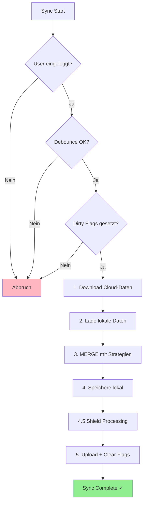

# Cloud Sync - Übersicht

Die Sudoku Duo App verwendet eine **Offline-First-Architektur** mit automatischer Cloud-Synchronisierung. Spielfortschritt wird lokal gespeichert und im Hintergrund mit Firebase synchronisiert.

---

## 👤 User Experience

### Was sieht der User?

| Situation | Was passiert | User Interface |
|-----------|--------------|----------------|
| **Nicht eingeloggt** | Daten nur lokal gespeichert | Settings: "Get Started" Button mit Vorteilen |
| **Erster Login** | Alle lokalen Daten → Cloud hochgeladen | Erfolgs-Alert: "Willkommen {Name}!" |
| **Zweites Gerät** | Cloud-Daten → Lokal heruntergeladen | Daten automatisch da |
| **Nach Spielende** | Sync passiert unsichtbar im Hintergrund | Keine Anzeige |
| **In Settings** | Sync-Status sichtbar | "Last Sync: Xm ago" + "Sync Now" Button |

### Sync-Status Anzeige (Settings)

```
┌─────────────────────────────────────┐
│  👤 Max Mustermann                  │
│  max@example.com                    │
│                                     │
│  ☁️ Dein Fortschritt wird          │
│     automatisch synchronisiert      │
│                                     │
│  ✓ Last Sync: Gerade eben          │
│                                     │
│  [ 🔄 Sync Now ]                   │
└─────────────────────────────────────┘
```

**Sync-Status:**
- ✓ (grün) = Letzte Synchronisierung erfolgreich
- ⚠️ (rot) = Fehler bei letzter Synchronisierung

**"Last Sync" Anzeige:**
- "Gerade eben" (< 1 Minute)
- "5m ago" (Minuten)
- "2h ago" (Stunden)
- "3d ago" (Tage)
- "Nie synchronisiert"

---

## ⏰ Wann wird synchronisiert?

### Trigger-Übersicht

```mermaid
flowchart TD
    A[App Event] --> B{Welches Event?}

    B -->|Spiel gewonnen| C[syncAfterGameCompletion]
    B -->|App öffnen| D[syncOnAppLaunch]
    B -->|App schließen| E[syncOnAppPause]
    B -->|Manual Button| F[manualSync]
    B -->|Login| G{Neuer User?}

    C -->|Force| H[Sync sofort]
    D -->|Debounce| I{15 Min vergangen?}
    E -->|Debounce| I
    F -->|Force| H

    G -->|Ja| J[Upload alles]
    G -->|Nein| K[Download alles]

    I -->|Ja| H
    I -->|Nein| L[Skip]

    style H fill:#90EE90
    style L fill:#FFB6C1
```



### Trigger-Tabelle

| Trigger | Wann? | Force? | Debounce? |
|---------|-------|--------|-----------|
| **Spiel gewonnen** | Nach jedem erfolgreichen Puzzle | ✅ Ja | ❌ Nein |
| **App öffnen** | App wird aktiv (Foreground) | ❌ Nein | ✅ 15 Min |
| **App Background** | App wird minimiert | ❌ Nein | ✅ 15 Min |
| **Manual Button** | User tippt "Sync Now" | ✅ Ja | ❌ Nein |
| **Erster Login** | Neuer Account erstellt | - | - |
| **Rückkehr-Login** | Bestehendes Konto | - | - |

### Was bedeutet "Force" und "Debounce"?

**Force (Erzwungen):**
- Sync passiert SOFORT
- Ignoriert Wartezeit
- Wichtig für kritische Daten (z.B. XP nach Spielende)

**Debounce (Wartezeit):**
- Mindestens **15 Minuten** zwischen Auto-Syncs
- Spart Akku und Datenvolumen
- Verhindert zu viele Cloud-Anfragen

---

## 📦 Was wird synchronisiert?

### Datentypen

| Datentyp | Beschreibung | Lokal | Cloud | Sync |
|----------|--------------|-------|-------|------|
| **Stats** | XP, Spiele, Bestzeiten | ✅ | ✅ | ✅ |
| **Daily Streak** | Streak-Zähler, Shields, History | ✅ | ✅ | ✅ |
| **Settings** | Theme, Sprache, Highlights | ✅ | ✅ | ✅ |
| **Color Unlock** | Freigeschaltete Pfadfarben | ✅ | ✅ | ✅ |
| **Landscapes** | Gallery-Fortschritt, Favoriten | ✅ | ✅ | ✅ |
| **Profile** | Name, Avatar, Titel | ✅ | ✅ | ✅ |
| **Paused Game** | Unterbrochenes Spiel | ✅ | ❌ | ❌ |
| **Laufendes Spiel** | Aktuelles Board | ✅ | ❌ | ❌ |

### Was wird NICHT synchronisiert?

- **Unterbrochene Spiele** - Zu groß, zu kurzlebig
- **Laufende Spiele** - Session-spezifisch
- **Cache-Daten** - Werden lokal neu generiert

### Detaillierte Datenstruktur

#### 📊 Stats (GameStats)

| Feld | Typ | Beschreibung |
|------|-----|--------------|
| `gamesPlayed` | number | Gesamtzahl gespielter Spiele |
| `gamesWon` | number | Gewonnene Spiele |
| `bestTimeEasy` | number | Bestzeit Easy (Sekunden, `Infinity` wenn ungesetzt) |
| `bestTimeMedium` | number | Bestzeit Medium |
| `bestTimeHard` | number | Bestzeit Hard |
| `bestTimeExpert` | number | Bestzeit Expert |
| `totalXP` | number | Gesamte Erfahrungspunkte |
| `reachedMilestones` | number[] | Erreichte Level-Meilensteine (0-24) |
| `completedEasy` | number | Abgeschlossene Easy-Puzzles |
| `completedMedium` | number | Abgeschlossene Medium-Puzzles |
| `completedHard` | number | Abgeschlossene Hard-Puzzles |
| `completedExpert` | number | Abgeschlossene Expert-Puzzles |
| `dailyStreak` | DailyStreakData | Streak-Daten (siehe unten) |
| `updatedAt` | number | Timestamp (Millisekunden) |

#### 🔥 Daily Streak (DailyStreakData)

| Feld | Typ | Beschreibung |
|------|-----|--------------|
| `currentStreak` | number | Aktuelle Streak-Tage |
| `longestDailyStreak` | number | Längste Streak (Rekord) |
| `lastPlayedDate` | string | Letzter Spieltag (YYYY-MM-DD) |
| `firstLaunchDate` | string | Erster App-Start (YYYY-MM-DD) |
| `shieldsAvailable` | number | Verfügbare Shields |
| `shieldsUsedThisWeek` | number | Diese Woche verwendete Shields |
| `lastShieldResetDate` | string | Letzter Montag (Reset-Datum) |
| `bonusShields` | number | Bonus-Shields (Lifetime) |
| `totalShieldsUsed` | number | Gesamt verwendete Shields |
| `playHistory` | Object | Kalender-Daten pro Monat |
| `playHistory[YYYY-MM].days` | number[] | Gespielte Tage [1, 3, 5, ...] |
| `playHistory[YYYY-MM].shieldDays` | number[] | Shield-Tage [2, 4] |
| `totalDaysPlayed` | number | Gesamte Spieltage |
| `completedMonths` | string[] | Vollständige Monate ["2024-12", ...] |
| `updatedAt` | number | Timestamp |

#### ⚙️ Settings (GameSettings)

| Feld | Typ | Beschreibung |
|------|-----|--------------|
| `highlightRelatedCells` | boolean | Zeile/Spalte/Box hervorheben |
| `showMistakes` | boolean | Fehler anzeigen |
| `highlightSameValues` | boolean | Gleiche Zahlen hervorheben |
| `autoNotes` | boolean | Auto-Notizen aktiviert |
| `darkMode` | 'light' \| 'dark' | Theme-Einstellung |
| `language` | 'de' \| 'en' \| 'hi' | Sprache |
| `fontScale` | number | Schriftgröße (0.85-1.25) |
| `vibration` | boolean | Haptisches Feedback |
| `soundEffects` | boolean | Soundeffekte |
| `backgroundMusic` | boolean | Hintergrundmusik |
| `highlightSameValuesModified` | boolean | Manuell geändert? (Tracking) |
| `highlightRelatedCellsModified` | boolean | Manuell geändert? (Tracking) |
| `showMistakesModified` | boolean | Manuell geändert? (Tracking) |
| `updatedAt` | number | Timestamp |

#### 🎨 Color Unlock (ColorUnlockData)

| Feld | Typ | Beschreibung |
|------|-----|--------------|
| `selectedColor` | string | Aktive Pfadfarbe (#RRGGBB) |
| `unlockedColors` | string[] | Freigeschaltete Farben |
| `updatedAt` | number | Timestamp |

**Freigeschaltete Farben nach Level:**
| Level | Farbe | Hex |
|-------|-------|-----|
| 1+ | Blau (Fundamentals) | #4285F4 |
| 5+ | Grün (Insight) | #34A853 |
| 10+ | Gelb (Mastery) | #F9AB00 |
| 15+ | Rot (Wisdom) | #EA4335 |
| 20+ | Lila (Transcendence) | #7C4DFF |

#### 👤 Profile (UserProfile)

| Feld | Typ | Beschreibung |
|------|-----|--------------|
| `displayName` | string \| null | Anzeigename |
| `email` | string \| null | E-Mail (nur Firestore) |
| `photoURL` | string \| null | Avatar-URI |
| `titleLevelIndex` | number \| null | Zen-Level Index (0-24) |
| `createdAt` | number | Erstellungsdatum |
| `updatedAt` | number | Timestamp |

#### 🏞️ Landscapes (LandscapeCollection)

| Feld | Typ | Beschreibung |
|------|-----|--------------|
| `currentImageId` | string \| null | Aktuelles Landschafts-Bild |
| `favorites` | string[] | Favoriten-IDs |
| `lastUsedFavoriteIndex` | number | Zuletzt verwendeter Favorit |
| `lastChangedDate` | string | Letzte Änderung (YYYY-MM-DD) |

**Pro Landschaft (`landscapes[id]`):**

| Feld | Typ | Beschreibung |
|------|-----|--------------|
| `id` | string | Landschafts-ID |
| `progress` | number | Freigeschaltete Segmente (0-9) |
| `isFavorite` | boolean | Als Favorit markiert |
| `isComplete` | boolean | Vollständig freigeschaltet |
| `completedAt` | string | Abschlussdatum (ISO) |

---

## 🔄 Wie funktioniert der Sync?

### Kompletter Sync-Ablauf



### Die Schritte im Detail

| Schritt | Was passiert | Dauer |
|---------|--------------|-------|
| 1. Download | Hole aktuelle Cloud-Daten | ~500ms |
| 2. Load Local | Lade AsyncStorage-Daten | ~50ms |
| 3. Merge | Wende Konflikt-Strategien an | ~10ms |
| 4. Save Local | Speichere gemergtes Ergebnis | ~50ms |
| 4.5. Shield Processing | Wende Shields retroaktiv an nach Sync | ~50ms |
| 5. Upload | Nur geänderte Dokumente hochladen (+ Clear Dirty Flags) | ~500ms |

**Gesamt:** ~1-2 Sekunden (je nach Netzwerk)

**Retry-Logik:** Bei Netzwerkfehlern werden bis zu 3 Versuche mit 2s Verzögerung durchgeführt.

---

## ⚔️ Konfliktauflösung

### Was passiert wenn zwei Geräte unterschiedliche Daten haben?

```
Gerät A (gespielt um 10:00):
├── XP: 500
├── Bestzeit Easy: 120 Sek
└── Theme: Dark

Gerät B (gespielt um 11:00):
├── XP: 450
├── Bestzeit Easy: 150 Sek
└── Theme: Light

Nach Merge:
├── XP: 500          (Max-Wert → A gewinnt)
├── Bestzeit: 120    (Min-Wert → bessere Zeit von A)
└── Theme: Light     (Last-Write-Wins → B ist neuer)
```

### Merge-Strategien pro Datentyp

| Datentyp | Strategie | Erklärung |
|----------|-----------|-----------|
| **Stats (XP, Spiele)** | Max-Wert | Höherer Wert gewinnt → kein Fortschritt geht verloren |
| **Bestzeiten** | Min-Wert | Bessere (niedrigere) Zeit gewinnt |
| **Milestones** | Union | Alle erreichten Level kombiniert |
| **Settings** | Last-Write-Wins | Neuerer Timestamp gewinnt |
| **Colors** | Union | Alle freigeschalteten Farben kombiniert |
| **Landscapes** | Max-Fortschritt | Höchster Freischalt-Stand pro Landschaft |
| **Favoriten** | Union | Alle Favoriten kombiniert |
| **Profile** | Heuristic | Local gewinnt wenn geändert (name ≠ 'User' ODER avatar ≠ null ODER title ≠ null), sonst Cloud |

### Daily Streak - Spezialfall

Der Daily Streak verwendet eine **Smart-Merge** Strategie:

```
┌──────────────────────────────────────────┐
│ playHistory:    UNION                    │
│                 (alle Tage kombiniert)   │
│                                          │
│ currentStreak:  LAST-WRITE-WINS          │
│                 (neueres Datum gewinnt)  │
│                                          │
│ bonusShields:   MAX                      │
│                 (höherer Wert)           │
│                                          │
│ firstLaunch:    MIN                      │
│                 (frühestes Datum)        │
└──────────────────────────────────────────┘
```

---

## 🔧 Technische Details

### Dirty Flags System

**Zweck:** Nur geänderte Daten hochladen → spart Bandbreite und Kosten

```
┌─────────────────────────────────────┐
│ Dirty Flags (AsyncStorage)          │
├─────────────────────────────────────┤
│ stats:       ✅ dirty               │
│ settings:    ❌ clean               │
│ colorUnlock: ✅ dirty               │
│ landscapes:  ❌ clean               │
│ profile:     ❌ clean               │
└─────────────────────────────────────┘

→ Nur stats und colorUnlock werden hochgeladen
```

**Wann werden Flags gesetzt?**
- `saveStats()` → `setDirty('stats')`
- `saveSettings()` → `setDirty('settings')`
- `saveColorUnlock()` → `setDirty('colorUnlock')`

**Wann werden Flags gelöscht?**
- Nach erfolgreichem Upload
- Nach erfolgreichem Download (Cloud ist Source of Truth)

### Timestamps

Jedes Dokument hat einen `updatedAt` Timestamp:

```typescript
{
  totalXP: 500,
  gamesPlayed: 10,
  updatedAt: 1735604932145  // Millisekunden seit 1970
}
```

**Verwendung:**
- Bestimmt "neuere" Daten bei Last-Write-Wins
- Wird bei jedem lokalen Save gesetzt
- Cloud-Timestamps werden bei Download beibehalten

### Firestore-Struktur

```
/users/{userId}                (Dokument)
├── profile: {                 ← Feld im User-Dokument (KEIN Subdokument!)
│     displayName: string
│     email: string
│     photoURL: string         (Avatar-URI)
│     titleLevelIndex: number  (Zen-Level 0-24)
│     createdAt: timestamp
│     updatedAt: timestamp
│   }
│
└── /data/                     (Subcollection)
    ├── stats                  (Dokument)
    │   ├── gamesPlayed
    │   ├── totalXP
    │   ├── bestTimeEasy/Medium/Hard/Expert
    │   ├── dailyStreak { ... }
    │   └── updatedAt
    │
    ├── settings               (Dokument)
    │   ├── darkMode
    │   ├── language
    │   ├── highlightRelatedCells
    │   └── updatedAt
    │
    ├── colorUnlock            (Dokument)
    │   ├── selectedColor
    │   ├── unlockedColors[]
    │   └── updatedAt
    │
    └── landscapes             (Dokument)
        ├── currentImageId
        ├── favorites[]
        ├── landscapes { ... }
        └── updatedAt
```

**Hinweis:** Das `profile`-Objekt ist ein Feld im User-Dokument selbst, NICHT ein separates Dokument in einer Subcollection. Es wird mit `{ merge: true }` aktualisiert.

---

## 🐛 Bekannte Einschränkungen

### 1. Re-Login überschreibt lokal

**Szenario:**
1. User spielt offline auf Gerät A
2. User loggt sich auf Gerät B ein
3. Cloud-Daten (älter) überschreiben Gerät B komplett

**Warum:** Bei Re-Login ist Cloud = Source of Truth (kein Merge)

**Workaround:** Immer erst "Sync Now" auf Gerät A bevor auf Gerät B einloggen

### 2. Kein Offline-Sync

Wenn der Sync fehlschlägt (offline):
- Dirty Flags bleiben gesetzt
- Nächster Sync-Versuch bei App Launch/Background
- Keine explizite Warteschlange

### 3. Unterbrochene Spiele nicht synchronisiert

- Pausiertes Sudoku-Board wird NICHT zur Cloud übertragen
- Bei Gerätewechsel muss das Spiel neu gestartet werden

### 4. 15-Minuten Wartezeit

Auto-Sync nur alle 15 Minuten → kurzfristige Änderungen nicht sofort in Cloud

**Ausnahmen:**
- Nach Spielende (Force-Sync)
- "Sync Now" Button (Force-Sync)

---

## 🚪 Logout-Verhalten

### Was passiert beim Ausloggen?

```
┌─────────────────────────────────────────┐
│ 1. Ungespeicherte Daten syncen          │
│    ↓                                     │
│ 2. Firebase ausloggen                   │
│    ↓                                     │
│ 3. ALLE lokalen Daten löschen           │
│    - Stats, Settings, Colors            │
│    - Landscapes, Profile                │
│    - Paused Game, Dirty Flags           │
│    ↓                                     │
│ 4. App verhält sich wie Neuinstallation │
└─────────────────────────────────────────┘
```

### Warum wird zurückgesetzt?

| Grund | Erklärung |
|-------|-----------|
| **Datenschutz** | Keine Daten des vorherigen Users bleiben |
| **Klarheit** | User weiß: Nach Logout = Clean Slate |
| **Kein Datenverlust** | Sync vor Logout sichert alles in Cloud |

### Wichtig für User

- ✅ Vor Logout werden Daten automatisch synchronisiert
- ⚠️ Nach Logout: Offline-Spielen startet bei 0
- ✅ Bei Re-Login: Alle Cloud-Daten werden wiederhergestellt

### Logout-Flow (Technisch)

```typescript
// contexts/AuthProvider.tsx - signOut()

1. hasAnyDirty() → Prüfe ob ungesyncte Änderungen
2. syncUserData({ force: true }) → Sync vor Logout
3. auth.signOut() → Firebase abmelden
4. resetAllLocalData() → Stats, Settings, Colors löschen
5. resetLandscapeData() → Gallery-Daten löschen
6. resetUserProfile() → Profil löschen
7. clearAllDirty() → Dirty Flags zurücksetzen
```

---

## 📁 Relevante Dateien

| Datei | Zweck |
|-------|-------|
| `utils/cloudSync/syncService.ts` | Sync-Orchestrierung, Debounce |
| `utils/cloudSync/downloadService.ts` | Cloud → Lokal |
| `utils/cloudSync/uploadService.ts` | Lokal → Cloud |
| `utils/cloudSync/mergeService.ts` | Konfliktauflösung |
| `utils/cloudSync/dirtyFlags.ts` | Änderungs-Tracking |
| `utils/storage.ts` | Lokale AsyncStorage-Operationen |
| `contexts/AuthProvider.tsx` | Login-Sync-Trigger |

---

## 🔍 Debugging

### Logs im Terminal

```
[SyncService] Step 1/5: Downloading cloud data...
[SyncService] Step 2/5: Loading local data...
[SyncService] Step 3/5: Merging data...
[SyncService] Step 4/5: Saving merged data locally...
[SyncService] Step 4.5/5: Processing streak data after sync...
[SyncService] Step 5/5: Uploading dirty documents to cloud...
[SyncService] ✅ Sync complete!
```

### Häufige Probleme

| Problem | Mögliche Ursache | Lösung |
|---------|------------------|--------|
| Sync startet nicht | Nicht eingeloggt | Login prüfen |
| Sync wird übersprungen | Debounce aktiv (< 15 Min) | "Sync Now" Button nutzen |
| Daten gehen verloren | Re-Login ohne vorherigen Sync | Erst Sync, dann Login auf anderem Gerät |
| Unendliche Sync-Loops | Dirty Flags nicht gelöscht | App neu starten |

---

**Letzte Aktualisierung:** Dezember 2024 (Review & Korrekturen)
