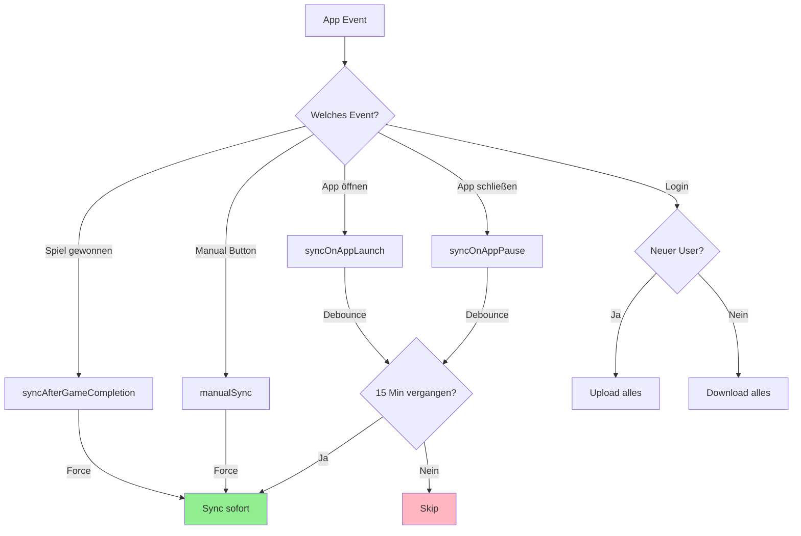
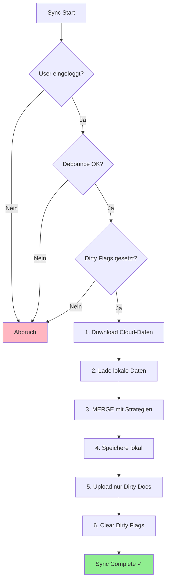

# Cloud Sync - Übersicht

Die Sudoku Duo App verwendet eine **Offline-First-Architektur** mit automatischer Cloud-Synchronisierung. Spielfortschritt wird lokal gespeichert und im Hintergrund mit Firebase synchronisiert.

---

## 👤 User Experience

### Was sieht der User?

| Situation | Was passiert | User Interface |
|-----------|--------------|----------------|
| **Nicht eingeloggt** | Daten nur lokal gespeichert | Settings: "Get Started" Button mit Vorteilen |
| **Erster Login** | Alle lokalen Daten → Cloud hochgeladen | Erfolgs-Alert: "Willkommen {Name}!" |
| **Zweites Gerät** | Cloud-Daten → Lokal heruntergeladen | Daten automatisch da |
| **Nach Spielende** | Sync passiert unsichtbar im Hintergrund | Keine Anzeige |
| **In Settings** | Sync-Status sichtbar | "Last Sync: Xm ago" + "Sync Now" Button |

### Sync-Status Anzeige (Settings)

```
┌─────────────────────────────────────┐
│  👤 Max Mustermann                  │
│  max@example.com                    │
│                                     │
│  ☁️ Dein Fortschritt wird          │
│     automatisch synchronisiert      │
│                                     │
│  ✓ Last Sync: Gerade eben          │
│                                     │
│  [ 🔄 Sync Now ]                   │
└─────────────────────────────────────┘
```

**Sync-Status:**
- ✓ (grün) = Letzte Synchronisierung erfolgreich
- ⚠️ (rot) = Fehler bei letzter Synchronisierung

**"Last Sync" Anzeige:**
- "Gerade eben" (< 1 Minute)
- "5m ago" (Minuten)
- "2h ago" (Stunden)
- "3d ago" (Tage)
- "Nie synchronisiert"

---

## ⏰ Wann wird synchronisiert?

### Trigger-Übersicht



### Trigger-Tabelle

| Trigger | Wann? | Force? | Debounce? |
|---------|-------|--------|-----------|
| **Spiel gewonnen** | Nach jedem erfolgreichen Puzzle | ✅ Ja | ❌ Nein |
| **App öffnen** | App wird aktiv (Foreground) | ❌ Nein | ✅ 15 Min |
| **App Background** | App wird minimiert | ❌ Nein | ✅ 15 Min |
| **Manual Button** | User tippt "Sync Now" | ✅ Ja | ❌ Nein |
| **Erster Login** | Neuer Account erstellt | - | - |
| **Rückkehr-Login** | Bestehendes Konto | - | - |

### Was bedeutet "Force" und "Debounce"?

**Force (Erzwungen):**
- Sync passiert SOFORT
- Ignoriert Wartezeit
- Wichtig für kritische Daten (z.B. XP nach Spielende)

**Debounce (Wartezeit):**
- Mindestens **15 Minuten** zwischen Auto-Syncs
- Spart Akku und Datenvolumen
- Verhindert zu viele Cloud-Anfragen

---

## 📦 Was wird synchronisiert?

### Datentypen

| Datentyp | Beschreibung | Lokal | Cloud | Sync |
|----------|--------------|-------|-------|------|
| **Stats** | XP, Spiele, Bestzeiten | ✅ | ✅ | ✅ |
| **Daily Streak** | Streak-Zähler, Shields, History | ✅ | ✅ | ✅ |
| **Settings** | Theme, Sprache, Highlights | ✅ | ✅ | ✅ |
| **Color Unlock** | Freigeschaltete Pfadfarben | ✅ | ✅ | ✅ |
| **Landscapes** | Gallery-Fortschritt, Favoriten | ✅ | ✅ | ✅ |
| **Profile** | Name, Avatar, Titel | ✅ | ✅ | ✅ |
| **Paused Game** | Unterbrochenes Spiel | ✅ | ❌ | ❌ |
| **Laufendes Spiel** | Aktuelles Board | ✅ | ❌ | ❌ |

### Was wird NICHT synchronisiert?

- **Unterbrochene Spiele** - Zu groß, zu kurzlebig
- **Laufende Spiele** - Session-spezifisch
- **Cache-Daten** - Werden lokal neu generiert

---

## 🔄 Wie funktioniert der Sync?

### Kompletter Sync-Ablauf



### Die 6 Schritte im Detail

| Schritt | Was passiert | Dauer |
|---------|--------------|-------|
| 1. Download | Hole aktuelle Cloud-Daten | ~500ms |
| 2. Load Local | Lade AsyncStorage-Daten | ~50ms |
| 3. Merge | Wende Konflikt-Strategien an | ~10ms |
| 4. Save Local | Speichere gemergtes Ergebnis | ~50ms |
| 5. Upload | Nur geänderte Dokumente hochladen | ~500ms |
| 6. Clear Flags | Markiere als synchronisiert | ~10ms |

**Gesamt:** ~1-2 Sekunden (je nach Netzwerk)

---

## ⚔️ Konfliktauflösung

### Was passiert wenn zwei Geräte unterschiedliche Daten haben?

```
Gerät A (gespielt um 10:00):
├── XP: 500
├── Bestzeit Easy: 120 Sek
└── Theme: Dark

Gerät B (gespielt um 11:00):
├── XP: 450
├── Bestzeit Easy: 150 Sek
└── Theme: Light

Nach Merge:
├── XP: 500          (Max-Wert → A gewinnt)
├── Bestzeit: 120    (Min-Wert → bessere Zeit von A)
└── Theme: Light     (Last-Write-Wins → B ist neuer)
```

### Merge-Strategien pro Datentyp

| Datentyp | Strategie | Erklärung |
|----------|-----------|-----------|
| **Stats (XP, Spiele)** | Max-Wert | Höherer Wert gewinnt → kein Fortschritt geht verloren |
| **Bestzeiten** | Min-Wert | Bessere (niedrigere) Zeit gewinnt |
| **Milestones** | Union | Alle erreichten Level kombiniert |
| **Settings** | Last-Write-Wins | Neuerer Timestamp gewinnt |
| **Colors** | Union | Alle freigeschalteten Farben kombiniert |
| **Landscapes** | Max-Fortschritt | Höchster Freischalt-Stand pro Landschaft |
| **Favoriten** | Union | Alle Favoriten kombiniert |

### Daily Streak - Spezialfall

Der Daily Streak verwendet eine **Smart-Merge** Strategie:

```
┌──────────────────────────────────────────┐
│ playHistory:    UNION                    │
│                 (alle Tage kombiniert)   │
│                                          │
│ currentStreak:  LAST-WRITE-WINS          │
│                 (neueres Datum gewinnt)  │
│                                          │
│ bonusShields:   MAX                      │
│                 (höherer Wert)           │
│                                          │
│ firstLaunch:    MIN                      │
│                 (frühestes Datum)        │
└──────────────────────────────────────────┘
```

---

## 🔧 Technische Details

### Dirty Flags System

**Zweck:** Nur geänderte Daten hochladen → spart Bandbreite und Kosten

```
┌─────────────────────────────────────┐
│ Dirty Flags (AsyncStorage)          │
├─────────────────────────────────────┤
│ stats:       ✅ dirty               │
│ settings:    ❌ clean               │
│ colorUnlock: ✅ dirty               │
│ landscapes:  ❌ clean               │
│ profile:     ❌ clean               │
└─────────────────────────────────────┘

→ Nur stats und colorUnlock werden hochgeladen
```

**Wann werden Flags gesetzt?**
- `saveStats()` → `setDirty('stats')`
- `saveSettings()` → `setDirty('settings')`
- `saveColorUnlock()` → `setDirty('colorUnlock')`

**Wann werden Flags gelöscht?**
- Nach erfolgreichem Upload
- Nach erfolgreichem Download (Cloud ist Source of Truth)

### Timestamps

Jedes Dokument hat einen `updatedAt` Timestamp:

```typescript
{
  totalXP: 500,
  gamesPlayed: 10,
  updatedAt: 1735604932145  // Millisekunden seit 1970
}
```

**Verwendung:**
- Bestimmt "neuere" Daten bei Last-Write-Wins
- Wird bei jedem lokalen Save gesetzt
- Cloud-Timestamps werden bei Download beibehalten

### Firestore-Struktur

```
/users/{userId}/
├── profile                    (Dokument)
│   ├── displayName
│   ├── email
│   ├── avatarUrl
│   ├── title
│   └── updatedAt
│
└── /data/                     (Subcollection)
    ├── stats                  (Dokument)
    │   ├── gamesPlayed
    │   ├── totalXP
    │   ├── bestTimeEasy/Medium/Hard/Expert
    │   ├── dailyStreak { ... }
    │   └── updatedAt
    │
    ├── settings               (Dokument)
    │   ├── darkMode
    │   ├── language
    │   ├── highlightRelatedCells
    │   └── updatedAt
    │
    ├── colorUnlock            (Dokument)
    │   ├── selectedColor
    │   ├── unlockedColors[]
    │   └── updatedAt
    │
    └── landscapes             (Dokument)
        ├── currentImageId
        ├── favorites[]
        ├── landscapes { ... }
        └── updatedAt
```

---

## 🐛 Bekannte Einschränkungen

### 1. Re-Login überschreibt lokal

**Szenario:**
1. User spielt offline auf Gerät A
2. User loggt sich auf Gerät B ein
3. Cloud-Daten (älter) überschreiben Gerät B komplett

**Warum:** Bei Re-Login ist Cloud = Source of Truth (kein Merge)

**Workaround:** Immer erst "Sync Now" auf Gerät A bevor auf Gerät B einloggen

### 2. Kein Offline-Sync

Wenn der Sync fehlschlägt (offline):
- Dirty Flags bleiben gesetzt
- Nächster Sync-Versuch bei App Launch/Background
- Keine explizite Warteschlange

### 3. Unterbrochene Spiele nicht synchronisiert

- Pausiertes Sudoku-Board wird NICHT zur Cloud übertragen
- Bei Gerätewechsel muss das Spiel neu gestartet werden

### 4. 15-Minuten Wartezeit

Auto-Sync nur alle 15 Minuten → kurzfristige Änderungen nicht sofort in Cloud

**Ausnahmen:**
- Nach Spielende (Force-Sync)
- "Sync Now" Button (Force-Sync)

---

## 📁 Relevante Dateien

| Datei | Zweck |
|-------|-------|
| `utils/cloudSync/syncService.ts` | Sync-Orchestrierung, Debounce |
| `utils/cloudSync/downloadService.ts` | Cloud → Lokal |
| `utils/cloudSync/uploadService.ts` | Lokal → Cloud |
| `utils/cloudSync/mergeService.ts` | Konfliktauflösung |
| `utils/cloudSync/dirtyFlags.ts` | Änderungs-Tracking |
| `utils/storage.ts` | Lokale AsyncStorage-Operationen |
| `contexts/AuthProvider.tsx` | Login-Sync-Trigger |

---

## 🔍 Debugging

### Logs im Terminal

```
[SyncService] Step 1/5: Downloading cloud data...
[SyncService] Step 2/5: Loading local data...
[SyncService] Step 3/5: Merging data with conflict resolution...
[SyncService] Step 4/5: Saving merged data locally...
[SyncService] Step 5/5: Uploading dirty documents...
[SyncService] ✅ Sync successful
```

### Häufige Probleme

| Problem | Mögliche Ursache | Lösung |
|---------|------------------|--------|
| Sync startet nicht | Nicht eingeloggt | Login prüfen |
| Sync wird übersprungen | Debounce aktiv (< 15 Min) | "Sync Now" Button nutzen |
| Daten gehen verloren | Re-Login ohne vorherigen Sync | Erst Sync, dann Login auf anderem Gerät |
| Unendliche Sync-Loops | Dirty Flags nicht gelöscht | App neu starten |

---

**Letzte Aktualisierung:** Dezember 2024
