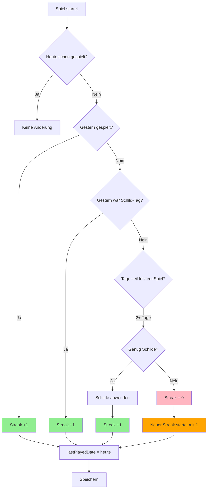
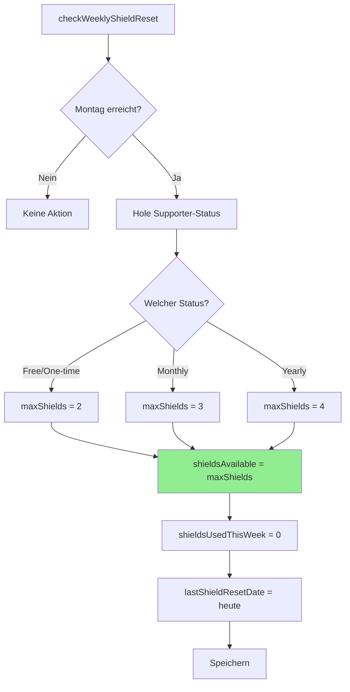
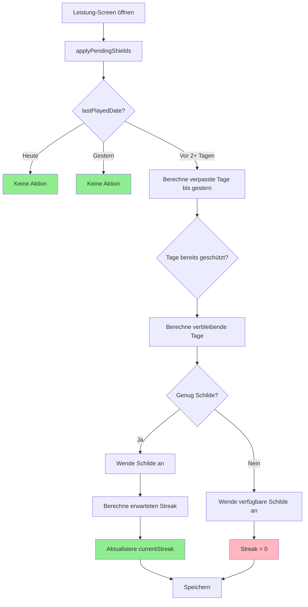
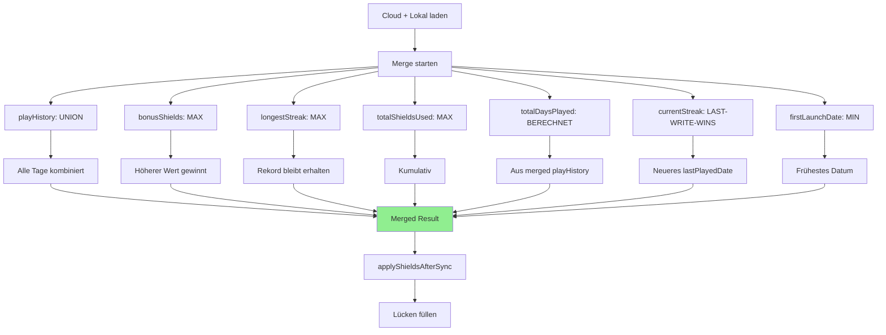
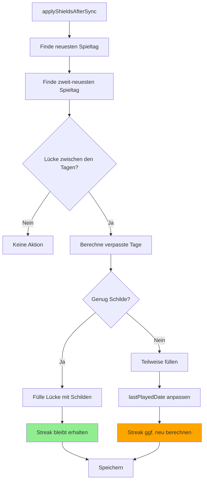

# Streak-System - Übersicht

Das Streak-System motiviert Spieler, täglich Sudoku zu spielen. Jeder konsekutive Spieltag erhöht den Streak-Zähler. Schutzschilder können verpasste Tage abdecken und den Streak retten.

---

## 🎯 Kernkonzepte

| Begriff | Beschreibung |
|---------|--------------|
| **Streak** | Anzahl aufeinanderfolgender Tage mit mindestens einem gewonnenen Spiel |
| **Spieltag** | Ein Tag, an dem mindestens ein Spiel erfolgreich beendet wurde |
| **Schild-Tag** | Ein verpasster Tag, der durch ein Schutzschild abgedeckt wurde |
| **Schutzschilder** | Ressource, die verpasste Tage "schützt" und den Streak erhält |
| **Bonus-Schilde** | Zusätzliche Schilde als Belohnung (z.B. durch Events) |

### Streak-Zählung

Ein Streak zählt **sowohl gespielte als auch geschützte Tage**:

```
Tag 1: Gespielt ✅     → Streak: 1
Tag 2: Gespielt ✅     → Streak: 2
Tag 3: Schild 🛡️      → Streak: 3 (geschützt)
Tag 4: Gespielt ✅     → Streak: 4
Tag 5: Nicht gespielt ❌ (kein Schild) → Streak: 0
```

---

## 🔄 Wie funktioniert der Streak?

### Wann wird der Streak aktualisiert?

Der Streak wird **beim Start eines neuen Spiels** aktualisiert (`updateDailyStreak()`), NICHT beim Abschluss. Dies stellt sicher, dass der Streak-Status immer aktuell ist, wenn der Spieler die App öffnet.

### Haupt-Flowchart: Streak-Update beim Spielstart



### Fallunterscheidungen im Detail

| Fall | Bedingung | Aktion | Ergebnis |
|------|-----------|--------|----------|
| **1** | Heute schon gespielt | Keine Änderung | Streak bleibt |
| **2a** | Gestern gespielt | Streak +1 | Streak erhöht |
| **2b** | Gestern war Schild-Tag | Streak +1 | Streak erhöht |
| **3a** | 2+ Tage, genug Schilde | Schilde anwenden, Streak +1 | Streak gerettet |
| **3b** | 2+ Tage, nicht genug Schilde | Streak = 0, neuer Start = 1 | Streak verloren |
| **4** | Erster Tag überhaupt | Streak = 1 | Streak beginnt |

### Beispiel-Szenarien

**Szenario 1: Normaler Streak-Aufbau**
```
Montag:    Spiel gewonnen → Streak: 1, lastPlayed: Mo
Dienstag:  Spiel gewonnen → Streak: 2, lastPlayed: Di
Mittwoch:  Spiel gewonnen → Streak: 3, lastPlayed: Mi
```

**Szenario 2: Streak mit Schild gerettet**
```
Montag:    Spiel gewonnen → Streak: 1, lastPlayed: Mo
Dienstag:  NICHT gespielt
Mittwoch:  App öffnen → applyPendingShields() wendet Schild auf Di an
           Spiel gewonnen → Streak: 3 (Mo + Di[Schild] + Mi)
```

**Szenario 3: Streak verloren (nicht genug Schilde)**
```
Montag:    Spiel gewonnen → Streak: 7, lastPlayed: Mo
Di-Fr:     NICHT gespielt (4 Tage verpasst)
Samstag:   App öffnen → nur 2 Schilde verfügbar
           2 Schilde angewendet (Di, Mi geschützt)
           Do, Fr nicht abgedeckt → Streak = 0
           Spiel gewonnen → Neuer Streak: 1
```

---

## 🛡️ Schutzschilder

### Schild-Typen

| Typ | Beschreibung | Quelle | Verfall |
|-----|--------------|--------|---------|
| **Reguläre Schilde** | Wöchentliches Kontingent | Montag-Reset (2/3/4 je nach Abo) | Jede Woche |
| **Bonus-Schilde** | Permanente Extra-Schilde | +1 pro Einmalkauf im Support-Shop | Nie |

### Wöchentliche Schild-Anzahl nach Supporter-Status

| Status | Schilde/Woche | Bonus-Schilde | Beschreibung |
|--------|---------------|---------------|--------------|
| **Free** | 2 | - | Standard für alle Spieler |
| **Einmalkauf** | 2 | +1 pro Kauf | Bonus-Schilde akkumulieren sich |
| **Monthly Abo** | 3 | - | +1 reguläres Schild pro Woche |
| **Yearly Abo** | 4 | - | +2 reguläre Schilde pro Woche |

### Schild-Verbrauch: Prioritätsregel

```
┌─────────────────────────────────────┐
│ Schild wird benötigt:               │
│                                     │
│ 1. Prüfe: shieldsAvailable > 0?     │
│    → Ja: shieldsAvailable--         │
│    → Nein: weiter zu Schritt 2      │
│                                     │
│ 2. Prüfe: bonusShields > 0?         │
│    → Ja: bonusShields--             │
│    → Nein: Kein Schild verfügbar!   │
│                                     │
│ 3. totalShieldsUsed++ (Statistik)   │
└─────────────────────────────────────┘
```

**Wichtig:** Reguläre Schilde werden IMMER zuerst verbraucht, Bonus-Schilde nur als Fallback.

### Wöchentlicher Reset (Montags)



**Reset-Zeitpunkt:** Jeden Montag um 00:00 Uhr (Geräte-Zeit)

**Wichtig:** `bonusShields` werden NICHT zurückgesetzt - sie bleiben dauerhaft erhalten!

### Automatische Schild-Anwendung

Es gibt **zwei Mechanismen** für die Schild-Anwendung:

#### 1. `applyPendingShields()` - Beim Öffnen der Leistung-Seite

Wird aufgerufen in `screens/Leistung/Leistung.tsx` beim Screen-Focus.



**Zweck:** UI zeigt sofort den korrekten Streak-Status, ohne auf ein Spiel zu warten.

#### 2. `updateDailyStreak()` - Bei Spielstart

Wird aufgerufen beim Start eines neuen Spiels. Wendet Schilde retroaktiv an, falls nötig.

**Unterschied:**
- `applyPendingShields()`: Schützt Tage bis **gestern**, inkrementiert Streak für geschützte Tage
- `updateDailyStreak()`: Schützt Tage bis **gestern** UND erhöht Streak +1 für **heute**

---

## 💎 Supporter-Integration

### Supporter-Status ermitteln

```typescript
// modules/subscriptions/entitlements.ts

interface SupporterStatus {
  isSupporter: boolean;           // Jemals gekauft (einmalig ODER Abo)
  isPremiumSubscriber: boolean;   // Aktives Abo läuft
  expiresAt: Date | null;         // Ablaufdatum (nur bei Abo)
  productId: string | null;       // Produkt-ID
  isInGracePeriod: boolean;       // Zahlungsproblem, aber noch aktiv
  supportType: 'none' | 'one-time' | 'subscription';
}
```

### Schild-Berechnung

```typescript
// modules/subscriptions/entitlements.ts - getMaxWeeklyShields()

async function getMaxWeeklyShields(status?: SupporterStatus): Promise<2 | 3 | 4> {
  const supporterStatus = status || (await getSupporterStatus());

  // Yearly Abo: 4 Schilde
  if (await isYearlySubscriber(supporterStatus)) {
    return 4;
  }

  // Monthly Abo: 3 Schilde
  if (supporterStatus.isPremiumSubscriber) {
    return 3;
  }

  // Free / Einmalkauf: 2 Schilde
  return 2;
}
```

### Schild-Logik nach Kauf

Je nach Kauf-Typ werden Schilde unterschiedlich behandelt:

**Einmalkauf → +1 Bonus-Schild (permanent)**
```typescript
// utils/dailyStreak.ts - addBonusShieldForPurchase()

await addBonusShieldForPurchase();
// → bonusShields wird um 1 erhöht (akkumuliert sich)
// Dies ist die EINZIGE Quelle für Bonus-Schilde!
```

**Subscription → Reguläre Schilde auffüllen**
```typescript
// utils/dailyStreak.ts - refillShields()

await refillShields('subscription', productId);
// → shieldsAvailable wird auf maxShields gesetzt (3 oder 4)
```

---

## 📊 Datenstruktur

### DailyStreakData (Hauptstruktur)

```typescript
// utils/storage.ts

type DailyStreakData = {
  // === Streak-Status ===
  currentStreak: number;           // Aktuelle Serie (0 = gebrochen)
  longestDailyStreak: number;      // Persönlicher Rekord
  lastPlayedDate: string;          // "2025-01-02" (YYYY-MM-DD)
  firstLaunchDate: string;         // Erster App-Start

  // === Schild-Management ===
  shieldsAvailable: number;        // Verfügbare reguläre Schilde
  shieldsUsedThisWeek: number;     // Diese Woche verbraucht
  lastShieldResetDate: string;     // Letzter Montag
  bonusShields: number;            // Bonus-Schilde (dauerhaft)
  totalShieldsUsed: number;        // Gesamt verbraucht (Statistik)

  // === Kalender-Daten ===
  playHistory: {
    [yearMonth: string]: MonthlyPlayData;
    // Beispiel: "2025-01": { days: [1, 3, 5], shieldDays: [2, 4] }
  };

  // === Statistiken ===
  totalDaysPlayed: number;         // Einzigartige Spieltage
  completedMonths: string[];       // Vollständige Monate ["2024-12"]

  // === Sync ===
  updatedAt?: number;              // Timestamp für Cloud-Sync
};
```

### MonthlyPlayData (Pro Monat)

```typescript
type MonthlyPlayData = {
  days: number[];        // Gespielte Tage: [1, 3, 5, 8, ...]
  shieldDays: number[];  // Geschützte Tage: [2, 4, 7, ...]
};
```

### Datenbeispiel

```json
{
  "currentStreak": 15,
  "longestDailyStreak": 23,
  "lastPlayedDate": "2025-01-02",
  "firstLaunchDate": "2024-11-15",

  "shieldsAvailable": 1,
  "shieldsUsedThisWeek": 1,
  "lastShieldResetDate": "2024-12-30",
  "bonusShields": 2,
  "totalShieldsUsed": 8,

  "playHistory": {
    "2024-12": {
      "days": [15, 16, 17, 19, 20, 21, 22, 23, 24, 26, 27, 28, 29, 30, 31],
      "shieldDays": [18, 25]
    },
    "2025-01": {
      "days": [1, 2],
      "shieldDays": []
    }
  },

  "totalDaysPlayed": 17,
  "completedMonths": [],
  "updatedAt": 1735833600000
}
```

---

## ☁️ Cloud-Synchronisierung

### Merge-Strategien für Streak-Daten

Der Streak verwendet eine **Smart-Merge** Strategie, die verschiedene Felder unterschiedlich behandelt:



### Merge-Strategie-Tabelle

| Feld | Strategie | Begründung |
|------|-----------|------------|
| `playHistory` | UNION | Alle gespielten Tage von beiden Geräten |
| `playHistory.shieldDays` | UNION | Alle geschützten Tage kombiniert |
| `bonusShields` | MAX | Belohnungen gehen nie verloren |
| `longestDailyStreak` | MAX | Rekord bleibt immer erhalten |
| `totalShieldsUsed` | MAX | Kumulative Statistik |
| `totalDaysPlayed` | BERECHNET | Aus merged playHistory neu berechnet |
| `completedMonths` | UNION | Alle vollständigen Monate |
| `currentStreak` | LAST-WRITE-WINS | Gerät mit neuerem `lastPlayedDate` gewinnt |
| `shieldsAvailable` | LAST-WRITE-WINS | Aktueller Stand vom aktivsten Gerät |
| `shieldsUsedThisWeek` | LAST-WRITE-WINS | Aktueller Stand vom aktivsten Gerät |
| `lastShieldResetDate` | LAST-WRITE-WINS | Aktueller Stand vom aktivsten Gerät |
| `lastPlayedDate` | LAST-WRITE-WINS | Neuestes Datum gewinnt |
| `firstLaunchDate` | MIN | Frühestes Datum (erster App-Start) |

### Nach dem Sync: `applyShieldsAfterSync()`

Nach dem Merge können Lücken in der `playHistory` entstehen. Diese Funktion füllt sie:



### Sync-Konflikt-Beispiel

```
Gerät A (letztes Spiel: 01.01.):
├── currentStreak: 10
├── playHistory["2025-01"].days: [1]
└── shieldsAvailable: 2

Gerät B (letztes Spiel: 02.01.):
├── currentStreak: 5
├── playHistory["2025-01"].days: [2]
└── shieldsAvailable: 1

Nach Merge:
├── currentStreak: 5        (B hat neueres lastPlayedDate)
├── playHistory["2025-01"].days: [1, 2]  (UNION)
└── shieldsAvailable: 1     (von B)

Nach applyShieldsAfterSync:
├── Keine Lücke (1 → 2 ist konsekutiv)
├── currentStreak wird ggf. neu berechnet aus playHistory
└── Ergebnis: Korrekter konsekutiver Streak
```

---

## 🔧 Wichtige Funktionen

### Übersicht

| Funktion | Datei | Auslöser | Zweck |
|----------|-------|----------|-------|
| `updateDailyStreak()` | dailyStreak.ts:131 | Spielstart | Streak aktualisieren |
| `applyPendingShields()` | dailyStreak.ts:512 | Leistung-Screen öffnen | Schilde sofort anwenden |
| `checkWeeklyShieldReset()` | dailyStreak.ts:776 | Spielstart / Sync | Montag-Reset prüfen |
| `applyShieldsAfterSync()` | dailyStreak.ts:381 | Nach Cloud-Sync | Lücken nach Merge füllen |
| `addBonusShieldForPurchase()` | dailyStreak.ts:931 | Einmalkauf | +1 Bonus-Schild hinzufügen |
| `refillShields()` | dailyStreak.ts:875 | Subscription-Kauf | Reguläre Schilde auffüllen |
| `useShield()` | dailyStreak.ts:693 | Intern | Ein Schild verbrauchen |
| `canUseShield()` | dailyStreak.ts:639 | Intern | Prüfen ob Schild verfügbar |
| `addShieldDayToHistory()` | dailyStreak.ts:95 | Intern | Schild-Tag speichern |
| `addToPlayHistory()` | dailyStreak.ts:51 | Intern | Spieltag speichern |
| `getMaxWeeklyShields()` | entitlements.ts:148 | Reset / UI | Max Schilde nach Status |

### Wichtige Helper-Funktionen

```typescript
// Datum-Funktionen
getTodayDate(): string;              // "2025-01-02"
isYesterday(date: string): boolean;  // Prüft ob gestern
getDaysBetween(a, b): number;        // Tage zwischen zwei Daten
addDaysToDate(date, n): string;      // Datum + n Tage
getNextMonday(date): Date;           // Nächster Montag
getLastMonday(date): Date;           // Letzter Montag
getDaysInMonth(yearMonth): number;   // Tage im Monat

// Schild-Prüfungen
isShieldDayRecorded(stats, date): boolean;  // Ist Tag geschützt?
```

---

## 🖥️ UI-Komponenten

### Komponenten-Hierarchie

```
LeistungScreen
└── StreakTab
    ├── CurrentStreakCard
    │   ├── Streak-Anzeige (Zahl + Flamme)
    │   ├── Längster Streak
    │   └── StreakCalendarGrid (Kalender)
    │       └── Tages-Zellen (gespielt/Schild/verpasst/heute)
    │
    ├── ShieldIndicator
    │   ├── Schild-Icons (gefüllt/leer)
    │   ├── Bonus-Schilde Anzeige
    │   └── Nächster Reset Countdown
    │
    └── StreakStats
        ├── Aktuelle Serie
        ├── Längste Serie
        ├── Gesamt Spieltage
        ├── Vollständige Monate
        └── Gesamt Schilde verwendet
```

### Kalender-Tag-Status

| Status | Anzeige | Bedeutung |
|--------|---------|-----------|
| `played` | ✅ Grün | Tag gespielt |
| `shield` | 🛡️ Blau | Tag mit Schild geschützt |
| `streak-broken` | ❌ Rot | Streak hier gebrochen |
| `inactive` | ⚪ Grau | Nach Streak-Bruch |
| `today` | 🔵 Blau Umrandung | Heute (noch offen) |
| `future` | ⚪ Transparent | Zukünftige Tage |
| `before-launch` | ⚪ Transparent | Vor App-Installation |

### Fortschrittsbalken

Der Fortschrittsbalken unter dem Kalender zeigt:
```
"X/31 Tage" = (gespielte Tage + Schild-Tage) / Tage im Monat
```

**Wichtig:** Beide Typen (gespielt UND Schild) zählen zum Fortschritt!

---

## 📝 Technische Details

### Datum-Format

Alle Daten werden im **ISO-Format** gespeichert: `YYYY-MM-DD`

```typescript
const today = new Date().toISOString().split('T')[0];
// Ergebnis: "2025-01-02"
```

### Zeitzonen-Handling

- Verwendet **lokale Geräte-Zeit** (nicht UTC)
- `new Date()` ohne Zeitzone = lokale Zeit
- String-Vergleiche funktionieren korrekt für ISO-Daten

### Monat-Key Format

```typescript
const yearMonth = `${year}-${String(month).padStart(2, '0')}`;
// Beispiel: "2025-01" für Januar 2025
```

### Migration

Bei App-Update von älteren Versionen wird `migrateToDailyStreak()` aufgerufen:

```typescript
// utils/storage.ts - migrateToDailyStreak()

1. Initialisiert DailyStreakData mit Standardwerten
2. Setzt shieldsAvailable basierend auf Supporter-Status
3. Setzt firstLaunchDate = heute
4. Setzt lastShieldResetDate = letzter Montag
```

---

## 📁 Relevante Dateien

| Datei | Zweck |
|-------|-------|
| `utils/dailyStreak.ts` | Kern-Logik für Streak und Schilde |
| `utils/storage.ts` | Datentypen, Speicher-Funktionen, Migration |
| `utils/cloudSync/mergeService.ts` | Merge-Strategien für Sync |
| `utils/cloudSync/syncService.ts` | Sync-Orchestrierung |
| `modules/subscriptions/entitlements.ts` | Supporter-Status und Schild-Berechnung |
| `screens/Leistung/Leistung.tsx` | Performance-Screen mit Streak-Tab |
| `screens/Leistung/components/StreakTab/` | Streak-Tab UI-Komponente |
| `screens/GameCompletion/components/StreakCard/` | Streak-Card Komponenten |

---

## 🔍 Debugging

### Log-Präfixe

| Präfix | Funktion |
|--------|----------|
| `[Daily Streak]` | updateDailyStreak() |
| `[Pending Shields]` | applyPendingShields() |
| `[Streak Sync]` | applyShieldsAfterSync() |
| `[calculateExpectedStreak]` | Streak-Neuberechnung |

### Beispiel-Logs

```
[Pending Shields] === CHECK ===
[Pending Shields] Today: 2025-01-02
[Pending Shields] Last played: 2024-12-30
[Pending Shields] Days missed (until yesterday): 2
[Pending Shields] Already shielded: 0, Days to shield: 2
[Pending Shields] Available shields: 2, Using: 2
[Pending Shields] Shield 1 applied to 2024-12-31
[Pending Shields] Shield 2 applied to 2025-01-01
[Pending Shields] ✅ Recalculating streak: 7 → 9
[Pending Shields] Stats saved
```

### Häufige Probleme

| Problem | Ursache | Lösung |
|---------|---------|--------|
| Streak zeigt 0 obwohl Schilde da | Schilde wurden nicht angewendet | Leistung-Screen öffnen (triggert applyPendingShields) |
| Schilde nicht aufgefüllt | Montag nicht erreicht | Warten bis Montag oder manuell prüfen |
| Sync überschreibt Streak | Cloud hat ältere Daten | Erst "Sync Now" auf aktivem Gerät |
| Fortschritt zeigt 0 | shieldDays nicht gezählt | Bug wurde gefixt (beide Arrays zählen) |

---

**Letzte Aktualisierung:** Januar 2025
